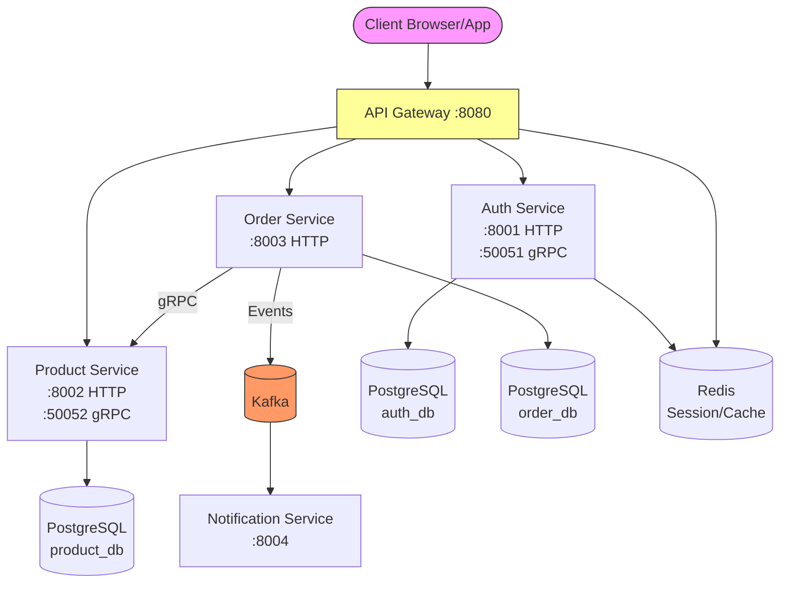
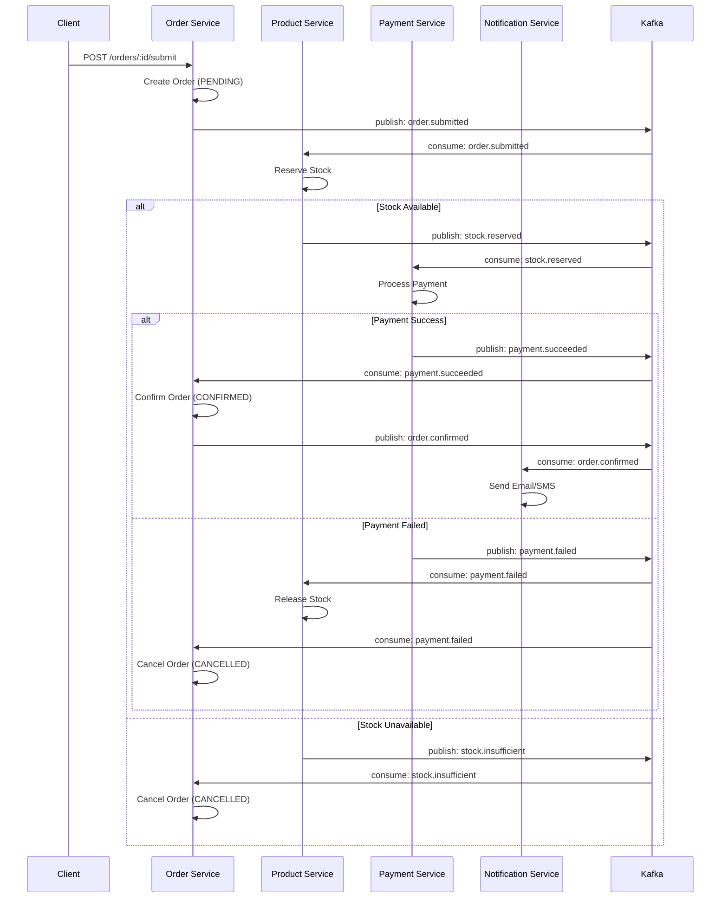
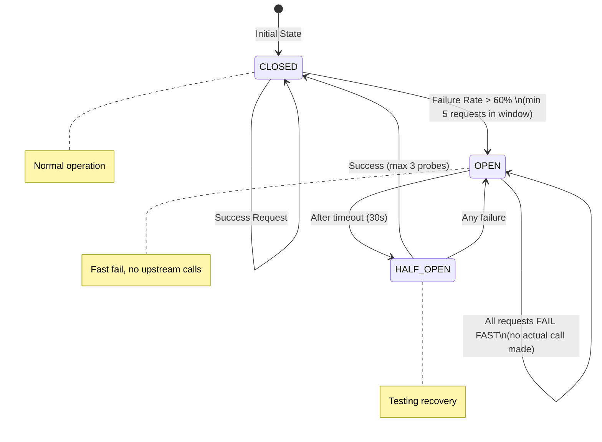

# Fase 7 — Architecture Diagrams

## E-Commerce Microservices System

```mermaid
graph TB
    Client([Client Browser/App])
    
    Client --> GW[API Gateway :8080]
    
    GW --> Auth[Auth Service\n:8001 HTTP\n:50051 gRPC]
    GW --> Product[Product Service\n:8002 HTTP\n:50052 gRPC]
    GW --> Order[Order Service\n:8003 HTTP]
    
    Order --> |gRPC| Product
    Order --> |Events| Kafka[(Kafka)]
    Kafka --> Notif[Notification Service\n:8004]
    
    Auth --> AuthDB[(PostgreSQL\nauth_db)]
    Product --> ProductDB[(PostgreSQL\nproduct_db)]
    Order --> OrderDB[(PostgreSQL\norder_db)]
    
    Auth --> Redis[(Redis\nSession/Cache)]
    GW --> Redis
    
    style Client fill:#f9f,stroke:#333
    style GW fill:#ff9,stroke:#333
    style Kafka fill:#f96,stroke:#333
```

## Saga Choreography Flow

```mermaid
sequenceDiagram
    participant C as Client
    participant OS as Order Service
    participant PS as Product Service
    participant PAY as Payment Service
    participant NS as Notification Service
    participant K as Kafka

    C->>OS: POST /orders/:id/submit
    OS->>OS: Create Order (PENDING)
    OS->>K: publish: order.submitted
    
    K->>PS: consume: order.submitted
    PS->>PS: Reserve Stock
    alt Stock Available
        PS->>K: publish: stock.reserved
        K->>PAY: consume: stock.reserved
        PAY->>PAY: Process Payment
        alt Payment Success
            PAY->>K: publish: payment.succeeded
            K->>OS: consume: payment.succeeded
            OS->>OS: Confirm Order (CONFIRMED)
            OS->>K: publish: order.confirmed
            K->>NS: consume: order.confirmed
            NS->>NS: Send Email/SMS
        else Payment Failed
            PAY->>K: publish: payment.failed
            K->>PS: consume: payment.failed
            PS->>PS: Release Stock
            K->>OS: consume: payment.failed
            OS->>OS: Cancel Order (CANCELLED)
        end
    else Stock Unavailable
        PS->>K: publish: stock.insufficient
        K->>OS: consume: stock.insufficient
        OS->>OS: Cancel Order (CANCELLED)
    end
```

## Circuit Breaker State Machine

```mermaid
stateDiagram-v2
    [*] --> CLOSED: Initial State
    
    CLOSED --> CLOSED: Success Request
    CLOSED --> OPEN: Failure Rate > 60% \n(min 5 requests in window)
    
    OPEN --> OPEN: All requests FAIL FAST\n(no actual call made)
    OPEN --> HALF_OPEN: After timeout (30s)
    
    HALF_OPEN --> CLOSED: Success (max 3 probes)
    HALF_OPEN --> OPEN: Any failure
    
    note right of CLOSED: Normal operation
    note right of OPEN: Fast fail, no upstream calls
    note right of HALF_OPEN: Testing recovery
```
